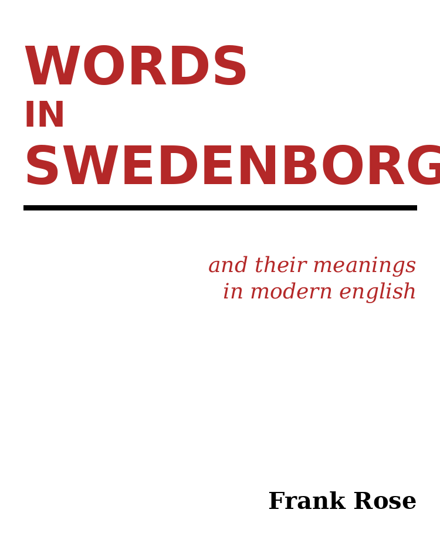

= Words in Swedenborg and Their Meanings in Modern English
:notitle:
:toc: preamble
:toclevels: 2
:sectnums!:
:doctype: book
:pdf-themesdir: book
:pdf-theme: pdf-theme.yml
:front-cover-image: 
:title-page:

[preface]
include::front-matter.adoc[]

[preface]
include::new-words.adoc[]

[preface]
include::theological-words.adoc[]

[preface]
include::archaic-words.adoc[]

include::swedenborg-glossary.adoc[]

<<<

include::back-matter.adoc[]
