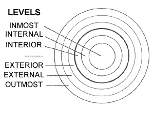
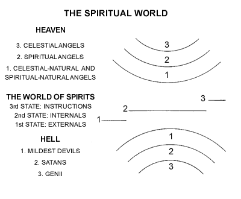
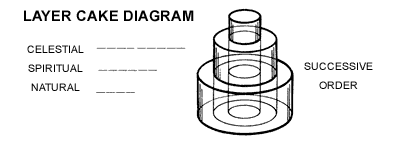
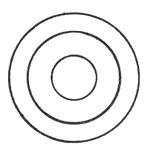

== Correspond, Represent, Signify

These three words are used frequently in Swedenborg, especially in explanations of the Scriptures. The different use of the words can be illustrated with a human smile.

*CORRESPOND*: If the smile is genuine, and originates in a happy feeling inside the person, the smile CORRESPONDS to the happiness.

*REPRESENT*: If the smile is fake, or is on a photograph or drawing, the smile REPRESENTS happiness.

*SIGNIFY*: The word "smile" SIGNIFIES or MEANS "smile".

In general, living things CORRESPOND, people and things REPRESENT, and words and phrases SIGNIFY.

== Levels

== The Spiritual World

== Levels Within the Word

* INMOST (OR SUPREME) SENSE
* CELESTIAL SENSE
* SPIRITUAL (OR INTERNAL) SENSE
* INTERNAL HISTORICAL SENSE
* LITERAL SENSE

== Layer Cake Diagram

These different levels are called "discrete degrees." Going from top to bottom is called "descending order" or "successive order."

If we imagine a slice-through view of the bottom layer, we see different areas on the same plane. These differences are called "continuous degrees" and the relationship is called "simultaneous order."

== Emanuel Swedenborg (1688-1772)

Swedenborg was born in Stockholm, Sweden, and spent his early years as a scientist, philosopher and civil servant. When he was in his mid fifties he went through a profound experience: Christ opened his eyes to the spiritual world, appeared to him and inspired him to write books on theology. He devoted the rest of his life to this work. Many people refer to these books as "The Writings". Altogether he wrote eighteen works, published from 1749 to 1771. They are listed here with the abbreviations sometimes used for them, the title, the number of pages in the Swedenborg Foundation's Standard Edition (English), and the date of the first Latin edition.

=== Published Works

[cols="1,4,1,1",options="header"]
|===
|Abbr.|Title|Pages|Date

|AC
|Arcana Caelestia (12 volumes)
|7094
|1749-1756

|HH
|Heaven and Hell
|397
|1758

|HD
|The New Jerusalem and its Heavenly Doctrine
|205
|1758

|LJ
|The Last Judgment
|78
|1758

|WH
|The White Horse
|24
|1758

|EU
|Earths in the Universe
|104
|1758

|D. Lord
|Doctrine of the Lord
|100
|1763

|SS
|Doctrine of the Sacred Scripture
|94
|1763

|Life
|Doctrine of Life
|58
|1763

|Faith
|Doctrine of Faith
|35
|1763

|CLJ
|Continuation concerning the Last Judgment
|40
|1763

|DLW
|Divine Love and Wisdom
|258
|1763

|DP
|Divine Providence
|364
|1764

|AR
|Apocalypse Revealed (2 volumes)
|996
|1766

|CL
|Conjugial Love
|525
|1768

|BE
|Brief Exposition
|99
|1769

|Infl.
|Influx, or the Intercourse between the Soul and Body
|33
|1769

|TCR
|True Christian Religion (2 volumes)
|986
|1771
|===

=== Unpublished Manuscripts

Swedenborg left a number of unpublished manuscripts, many of them drafts of other books. Most of them are listed here with the abbreviations sometimes used, the title commonly used (since many of them were not given a title by Swedenborg), and the estimated date of writing.

[cols="1,4,1",options="header"]
|===
|Abbr.|Title|Date

|SD
|Spiritual Diary (Spiritual Experiences) (5 vols. 2065 pp.)
|1745-1765

|AE
|The Apocalypse Explained (6 vols. 3336 pp.)
|1757-1759

|Ath.
|The Athanasian Creed (50 pp.)
|1759-1763

|Dom.
|De Domino (concerning the Lord) (8 pp.)
|1759-1763

|PP
|Internal Sense of the Prophets and Psalms (162 pp.)
|1759-1763

|Verbo
|De Verbo (concerning the Word) (50 pp.)
|1759-1763

|LJ Post
|Last Judgment (posthumous) (136 pp.)
|1759-1763

|D. Love
|Divine Love (35 pp.)
|1759-1763

|D. Wis.
|Divine Wisdom (72 pp.)
|1759-1763

|C
|Doctrine of Charity (49 pp.)
|1766

|5 M
|Five Memorable Relations (12 pp.)
|1766

|Mar.
|On Marriage (32 pp.)
|1766

|Can.
|Canons (56 pp.)
|1769-1772

|Ecc.Hist.
|Ecclesiastical History of the New Church (2 pp.)
|1769-1772

|Coro.
|Coronis (79 pp.)
|1769-1772

|Inv.
|Invitation to the New Church (23 pp.)
|1769-1772
|===
